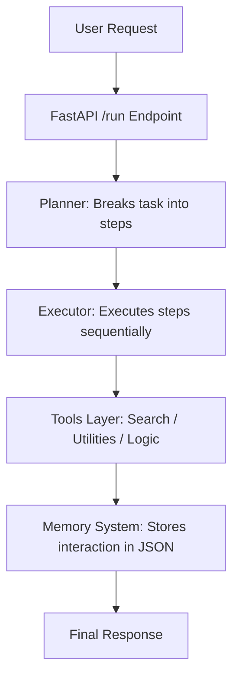

# 🧠 Hermes Agent Assistant

A lightweight agentic AI system built with FastAPI that demonstrates a modular AI architecture with a **Planner → Executor → Tools → Memory** workflow.

It is designed to simulate how modern AI agents break down tasks, plan steps, execute actions, and store memory for future reasoning.

---

## 🚀 Features

* **🧠 Planner Module:** Multi-step reasoning engine that breaks down complex user objectives.
* **⚙️ Executor Engine:** Orchestrates task execution sequentially by coordinating tools.
* **🔎 Tool-Based System:** Simulated search, utilities, and logic layers.
* **💾 Persistent Memory:** Lightweight, JSON-based storage for maintaining contextual history.
* **🌐 REST API:** Built entirely with FastAPI for rapid performance and standard compliance.
* **📄 Auto-Generated Docs:** Interactive Swagger UI available instantly at `/docs`.

---

## 🏗️ Architecture



---

## ⚙️ Tech Stack

* **Language:** Python 3.10+
* **Framework:** FastAPI
* **Server:** Uvicorn
* **Storage:** JSON Memory Store
* **Design:** Modular Agent Architecture

---

## 📡 API Endpoints

### 🟢 Root

* **Method:** `GET`
* **Path:** `/`
* **Response:**
```json
{
  "message": "🔥 Hermes Agent is running"
}

```


```

### 🧠 Run Agent
*   **Method:** `POST`
*   **Path:** `/run`
*   **Query Param:** `task` (e.g., `/run?task=search AI agents`)
*   **Response:**
    ```json
    {
      "task": "search AI agents",
      "plan": ["step1", "step2"],
      "result": "final output"
    }

```

### 📚 API Docs

* **Path:** `/docs`
* **Description:** Swagger UI auto-generated by FastAPI.

---

## 🧠 How Hermes Agent Works

* **Planner:** Analyzes the core task and slices it into structured, actionable items. *(e.g., "Explain AI agents" ➔ analyze ➔ search ➔ summarize).*
* **Executor:** Loops through each planned step and calls upon specific tools in order.
* **Tools Layer:** Contains the functional code or mock utilities needed to query data or compute answers.
* **Memory System:** Writes the results back to a persistent local `memory.json` file to track the session context.

---

## 📦 Installation

```bash
# Clone the repository
git clone https://github.com/tanush326k/hermes-agent-assistant.git
cd hermes-agent-assistant

# Create and activate a virtual environment
python -m venv venv
source venv/bin/activate  # Mac/Linux
# venv\Scripts\activate   # Windows alternative

# Install requirements
pip install -r requirements.txt

```

---

## ▶️ Run Locally

```bash
uvicorn app.main:app --reload

```

Once running, open your browser and navigate to: **[http://127.0.0.1:8000](http://127.0.0.1:8000)**

---

## 🌍 Deployment

This repository is optimized for quick hosting on platforms like **Render** or **Railway**.

* **Start Command:**
```bash
uvicorn app.main:app --host 0.0.0.0 --port 10000

```


```

---

## 🧪 Future Improvements

*   🤖 **Real LLM Integration:** Connect natively to OpenAI, Anthropic, or local open-source models via Ollama.
*   🗄️ **Vector Database Memory:** Upgrade the JSON store to a vector store like FAISS or ChromaDB for semantic search.
*   🤝 **Multi-Agent Collaboration:** Introduce distinct specialist agents that talk to each other to solve problems.
*   ⚡ **Streaming Responses:** Implement Server-Sent Events (SSE) or WebSockets to stream agent thoughts live.
*   🛠️ **Tool API Expansion:** Build out real-world tool endpoints (GitHub API, Weather API, Web Scrapers).

```
