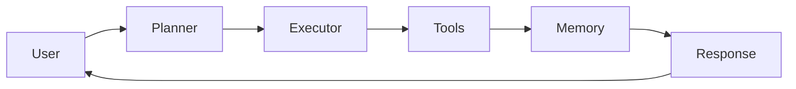
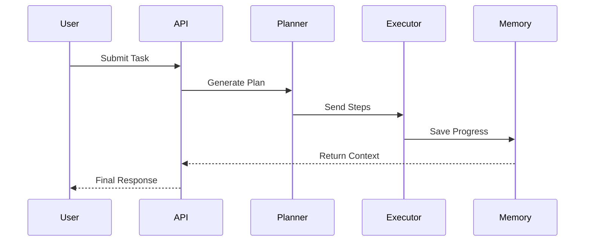

<div align="center">

# 🧠 Hermes Agent Assistant

### A Lightweight AI Agent Framework built with FastAPI

Design • Plan • Execute • Remember

[](https://hermes-agent-tanush.onrender.com)


### 🌐 Live Application

**https://hermes-agent-tanush.onrender.com**

</div>

---

# 🚀 What is Hermes?

Hermes Agent Assistant demonstrates how an AI agent processes a task by separating planning, execution, tool usage, and memory into independent stages.

Instead of producing a direct response, Hermes follows a structured workflow similar to modern autonomous AI systems.

---

# ⚡ Core Components

| Component | Responsibility |
|-----------|----------------|
| 🧠 Planner | Breaks complex goals into manageable steps |
| ⚙️ Executor | Executes each planned action sequentially |
| 🔧 Tools | Performs utility functions and external operations |
| 💾 Memory | Stores execution history for future context |
| 🌐 FastAPI | Exposes the agent through REST APIs |

---

# 🧩 Agent Pipeline



---

# 🔄 Request Lifecycle



---

# 📡 API Endpoints

| Method | Endpoint | Description |
|---------|----------|-------------|
| GET | `/` | Health check |
| POST | `/run` | Execute an agent task |
| GET | `/docs` | Interactive Swagger documentation |

---

# 🛠 Tech Stack

| Layer | Technology |
|--------|------------|
| Backend | FastAPI |
| Language | Python |
| Documentation | Swagger / OpenAPI |
| Storage | Local Memory |
| Deployment | Render |

---

# 📂 Project Structure

```text
hermes-agent-assistant/

├── app/
│   ├── planner.py
│   ├── executor.py
│   ├── tools.py
│   ├── memory.py
│   └── main.py
│
├── requirements.txt
├── README.md
└── LICENSE
```

---

# ▶️ Run Locally

```bash
git clone https://github.com/tanush326k/hermes-agent-assistant.git

cd hermes-agent-assistant

python -m venv venv

pip install -r requirements.txt

uvicorn app.main:app --reload
```


---

# 🎯 Why This Project?

Hermes is designed to demonstrate the fundamental architecture behind AI agents.

It showcases:

- Structured reasoning
- Sequential task execution
- Modular agent design
- Memory-driven workflows
- Clean REST API architecture

---

# 🔮 Future Improvements

- 🤖 LLM Integration
- 🧠 Vector Memory
- 🌍 Web Search Tool
- 📂 File Management Tools
- 👥 Multi-Agent Collaboration
- ⚡ Streaming Responses
- 📊 Agent Execution Visualization

---

# 🤝 Contributing

Contributions are welcome!

1. Fork the repository
2. Create a new branch
3. Commit your changes
4. Open a Pull Request

---

# 📄 License

This project is licensed under the **MIT License**.

---

<div align="center">

### 💡 Build once. Plan smart. Execute better.

⭐ **If you found this project useful, consider giving it a star!**

</div>
````
